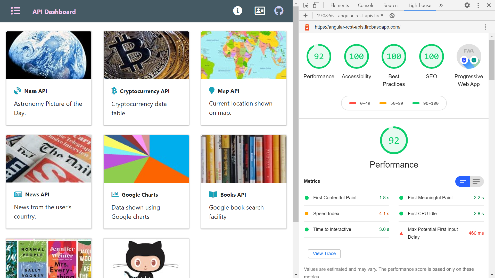

# :zap: PEAN Full Stack API Display

* PostgreSQL Express Angular Node (PEAN) full-stack app, integrates Angular frontend with Node.js backend. Shows a collection of API data.

*** Note: to open web links in a new window use: _ctrl+click on link_**

## :page_facing_up: Table of contents

* [General info](#general-info)
* [Screenshots](#screenshots)
* [Technologies](#technologies)
* [Setup](#setup)
* [Features](#features)
* [Status](#status)
* [Inspiration](#inspiration)
* [Contact](#contact)

## :books: General info

### Backend

* to follow

### Frontend

* Angular frontend includes Bootstrap responsive navbar with icon links
* Main section made of cards that link to API data
* NASA card shows Astronomy Picture of the Day (APOD) from the [NASA API](https://api.nasa.gov/)
* Crypto card shows prices of a list of cryptocurrencies from the [CryptoCompare API](https://min-api.cryptocompare.com/)
* Map card shows location data from the [ipapi API](https://ipapi.co/)
* News card shows latest news from the [newsapi](https://newsapi.org/)
* Google charts card shows a range of charts
* Data card shows data from a data API using [Google Charts](https://developers.google.com/chart/)
* Progressive Web App (PWA) functionality added
* Very high Lighthouse score but can be tweaked to be even higher - use jp2 images etc

## :camera: Screenshots



## :signal_strength: Technologies - Backend

* to follow

## :signal_strength: Technologies - Frontend

* [Angular framework v9](https://angular.io/)
* [Angular Universal](https://angular.io/guide/universal) Server-Side Rendering(SSR) by a Node Express web server
* [Bootstrap v4](https://getbootstrap.com/)
* [Font Awesome icons](https://fontawesome.com/icons?d=gallery)
* [Font Awesome](https://fontawesome.com/) icons
* [jQuery v3](https://jquery.com/download/) required by Bootstrap. Latest version 3.5.1 resolved nav-bar breaking change in previous version.
* [Angular Express Engine](https://www.npmjs.com/package/@nguniversal/express-engine) for running Angular Apps on the server for server side rendering
* [Google Chrome Lighthouse](https://developers.google.com/web/tools/lighthouse) to check quality of website
* [Google Charts](https://developers.google.com/chart/interactive/docs/gallery)

## :floppy_disk: Setup - Backend

* to follow

## :floppy_disk: Setup - Frontend

* Install dependencies using `npm i`
* Get yourself API keys for the Nasa, Google Maps and News apps
* Run `ng serve` for a dev server. Frontend will open at `http://localhost:4200/` - refreshes on code changes
* Run `npm run lint` to lint test entire codebase
* Run `npm run test` to run testing
* Run `npm run e2e` to run end-to-end testing files in individual modules etc.
* Run `npm run build:ssr` to generate a Server-Side-Rendered build file
* Run `npm run serve:ssr` to see on a dev server
* Run `firebase deploy` to deploy to Google Firebase Hosting (already setup)

## :computer: Code Examples - Backend

* to follow

```javascript

```

## :computer: Code Examples - Frontend NASA API

* function to get APOD data from NASA API as Observable using an Apod model response

```typescript
export class NasaService {
apiKey: string = "";

constructor(private http: HttpClient) {}

public getNasaImage(): Observable<Apod> {
  const year = new Date().getFullYear();
  const month = new Date().getMonth() + 1;
  const day = new Date().getDate();
  this.apiKey = environment.NASA_KEY;
  const apodUrl = `https://api.nasa.gov/planetary/apod?date=${year}-${month}-${day}&api_key=${this.apiKey}&hd=true`;
  return this.http
    .get<Apod>(apodUrl);
  }
}
```

## :cool: Features - Backend

* to follow

## :cool: Features - Frontend

* [Versión 81.0.4044.92 (Build oficial) (64 bits)](https://www.google.com/chrome/) latest version was required to get e2e testing to work

## :clipboard: Status & To-Do List

* Status: frontend Nasa, Crypto and map APIs working. More APIs to finish
* To-Do: complete frontend then do backend APIs.

## :clap: Inspiration/General Tools

* [Seth Gwartney, article: Server Side Rendering with Angular Universal](https://alligator.io/angular/angular-universal/)
* [Vidéo 2 - Ajouter un marker à carte Leaflet affichée par une application Angular 9](https://www.youtube.com/watch?v=d2G9YvscDmk)
* [PostgreSQL Quick Command List](http://jcsites.juniata.edu/faculty/rhodes/dbms/pgsql.htm)
* [Sitemaps XML format](https://www.sitemaps.org/protocol.html) used to create `sitemap.xml` to improve Lighthouse SEO score to 100%
* [Archive converter](https://convertio.co/es/) converts png to jp2 etc

## :envelope: Contact

* Repo created by [ABateman](https://www.andrewbateman.org) - you are welcome to [send me a message](https://andrewbateman.org/contact)
