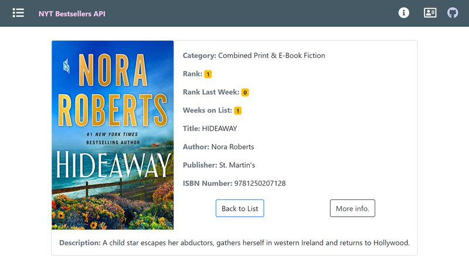

# :zap: PEAN Full Stack API Display

* PostgreSQL Express Angular Node (PEAN) full-stack app
* PostgreSQL backend database using Node.js/express.js to perform CRUD operations on data
* Angular frontend with Bootstrap styling to display API and backend data
* **Note:** to open web links in a new window use: _ctrl+click on link_


## :page_facing_up: Table of contents

* [General info](#general-info)
* [Screenshots](#screenshots)
* [Technologies](#technologies)
* [Setup](#setup)
* [Features](#features)
* [Status](#status)
* [Inspiration](#inspiration)
* [Contact](#contact)

## :books: General info

* Using Angular Server Side Rendering [causes problems with @angular/fire, @agm/core, and @ngx-translate](https://medium.com/@gregor.srdic/running-an-angular-universal-app-on-google-cloud-a712f66565d9) - try deploying to Google App Engine

* ### Backend

* During dev PostgreSQL needs to be installed and running - I started it from my Windows 10 PostgreSQL 12 dropdown option 'SQL shell (psql)' or from the Node.js command prompt
* Data for Google Charts data page stored in a Postgres database then displayed on the frontend using Express.js

### Frontend

* Angular frontend includes Bootstrap responsive navbar with icon links
* Navbar drops down from top in phone size
* About this site page - summary info on each page
* Author info card that gets data from Github and provides contact links
* Main section made of 8 Bootstrap cards that link to API data
* Crypto card shows prices of a list of cryptocurrencies from the [CryptoCompare API](https://min-api.cryptocompare.com/)
* Map card shows location data from the [ipapi API](https://ipapi.co/) using the Leaflet JavaScript maps library.**Does not use passive listeners to improve scrolling performance**
* NYT News card shows latest news from the [New York Times Top Stories API](https://developer.nytimes.com/docs/top-stories-product/1/overview)
* Google charts card shows a range of charts using the [Google Charts API](https://developers.google.com/chart/) **Fix/replace pie chart labels, Does not use passive listeners to improve scrolling performance**
* Google Book search card lets user search for any book. Results displayed in an array of Bootstrap cards. Clicking on a book shows it in detail.**Book links do not use HTTPS, Displays images with incorrect aspect ratio**
* New York Times API - bestseller list displayed. Clicking on a bestseller shows it in a detail page with a link to the original article.**Displays images with incorrect aspect ratio**
* Github card shows Github repo details from user search. Repo button redirects to repo list page. **github pagination to show more than 30 repos, add sessionStorage**
* Deployed version: good Lighthouse score (mobile): home page: performance: 91% ('Remove dead rules from stylesheets and defer the loading of CSS not used for above-the-fold content to reduce unnecessary bytes consumed by network activity.'), accessibility: 100%, Best practises: 100%, SEO 100%, PWA. **Add cache policy, remove unused Bootstrap CSS**
* [Versión 81.0.4044.92 (Build oficial) (64 bits)](https://www.google.com/chrome/) latest version was required to get e2e testing to work

## :camera: Screenshots





## :signal_strength: Technologies - Backend

* [PostgreSQL v12](https://www.postgresql.org/)
* [PostgreSQL Installer for Windows](https://www.postgresqltutorial.com/install-postgresql/)
* [Express.js middleware v4](https://expressjs.com/)
* [Node.js v12](https://nodejs.org/es/)
* [Nodemon](https://www.npmjs.com/package/nodemon) npm module so backend server will automatically restart after code changes
* [Postman API](https://www.postman.com/downloads/) to simulate a frontend

## :signal_strength: Technologies - Frontend

* [Angular framework v11](https://angular.io/)
* [Angular Universal v11](https://angular.io/guide/universal) Server-Side Rendering(SSR) by a Node Express web server
* [Bootstrap v4](https://getbootstrap.com/)
* [Font Awesome icons](https://fontawesome.com/icons?d=gallery) converted to svg components
* [jQuery v3](https://jquery.com/download/) required by Bootstrap. Latest version 3.5.1 resolved nav-bar breaking change in previous version.
* [Angular Express Engine v11](https://www.npmjs.com/package/@nguniversal/express-engine) for running Angular Apps on the server for server side rendering
* [Google Chrome Lighthouse](https://developers.google.com/web/tools/lighthouse) to check quality of website
* [Google Charts](https://developers.google.com/chart/interactive/docs/gallery)
* [Palantir](https://palantir.github.io/tslint/) extensible linter for the TypeScript language
* [Favicon generator website](https://favicon.io/favicon-generator/) to generate the simple 'AB' favicon
* [Node.js compression middleware](https://www.npmjs.com/package/compression)
* [UnCSS Online](https://uncss-online.com/) to identify unused CSS. Useful and simple tool.
* [Window sessionStorage](https://www.w3schools.com/jsref/prop_win_sessionstorage.asp) used to store book search strings.
* [ngx-picture](https://www.npmjs.com/package/ngx-picture) Angular library - [Github link](https://github.com/JayChase/ngx-picture) - to help properly size, lazy load images, and use next generation formats.
* [Easy-Resize.com](https://www.easy-resize.com/en/) to resize pictures online

## :floppy_disk: Setup - Backend

* Install dependencies using `npm i`
* Install [nodemon](https://www.npmjs.com/package/nodemon) globally if you don't already have it
* Install [PostgreSQL](https://www.postgresql.org/) & run it (requires the password you created during installation)
* Add database access credentials to `db.js` - recommend installing [npm dotenv](https://www.npmjs.com/package/dotenv) & using .env to hide credentials if commiting to Github
* Postgresql shell commands: `\l` list all databases. `\c database1` connect to database1. `\dt` to list all tables. `\d+` to inspect table. `\d table1` to see description of table1 & show relation information. `\q` to quit
* **From root run `npm run start` for a dev server**
* During dev `http://localhost:5000/` can be accessed for CRUD operations such as POST, GET, PUT, DELETE etc. using Postman

## :floppy_disk: Setup - Frontend

* Install dependencies using `npm i`
* Run `npm outdated` to see if any npm dependencies are outdated.
* Get yourself API keys for the Nasa, Google Maps and News apps
* Run `ng serve` for a non-SSR dev server. Frontend will open at `http://localhost:4200/` - refreshes on code changes
* Run `npm run dev:ssr` for an SSR dev server. Frontend will open at `http://localhost:4200/` - refreshes on code changes
* Run `npm run lint` to lint test entire client-side codebase using TSLint.
* Run `npm run build` to generate a build file without SSR
* Run `npm run build:ssr` to generate a build file with SSR. Add `defer` to browser css file ref.
* Run `npm run serve:ssr` to see on a dev server `http://localhost:4000`
* Run `ng deploy` to deploy to Google Firebase Hosting (already setup)

## :wrench: Testing

* Run `ng test` to run Jasmine unit tests via [Karma](https://karma-runner.github.io)
* Run `ng e2e` to execute the end-to-end tests via [Protractor](http://www.protractortest.org/).

## :computer: Code Examples - Backend

* database.sql to create a table

```sql
CREATE TABLE metalsData(
  element VARCHAR(20),
  density DOUBLE PRECISION,
  color VARCHAR(20),
  symbol VARCHAR(2)
);
```

## :computer: Code Examples - Frontend NASA API

* function to get Github user and repo data from Github API as Observable using User and Repo model responses

```typescript
export class GithubService {
  constructor(private http: HttpClient) {}

  getUser(user: string): Observable<User> {
    const userSearchUrl = `${baseUrl + user}`;
    return this.http
      .get<User>(userSearchUrl, { params })
      .pipe(
        take(1),
        catchError((err) => {
          return throwError(
            "There was a problem fetching data from Github API, error: ",
            err
          );
        })
      );
  }

  getRepos(user: string): Observable<Repo> {
    const repoSearchUrl = `${
      baseUrl + user + "/repos?order=updated&sort=desc?per_page=100&page=1"
    }`;

    return this.http
      .get<Repo>(repoSearchUrl, { params })
      .pipe(
        take(1),
        catchError((err) => {
          return throwError(
            "There was a problem fetching data from Github API, error: ",
            err
          );
        })
      );
  }
}
```

## :cool: Features - Backend

* All data stored in PostgreSQL database that can also be viewed and changed from the PostgreSQL shell (psql) or other command prompt

## :cool: Features - Frontend

* [http data handling best practices](https://angular.io/guide/http) followed - i.e. use of separate service file to get API data then use of subscription callback function in component to subscribe to Observable data. Response object type defined using an interface model. Interface passed as type parameter to the HttpClient.get() method. Transformed data passed to async pipe.
* [RxJS take](https://rxjs-dev.firebaseapp.com/api/operators/take)) used instead of map() to emit only the first count value emitted by the source Observable. Then it completes - so no need to unsubscribe to avoid memory leaks.
* [Angular Activated Route snapshot params](https://angular.io/api/router/ActivatedRoute) used to pass username from github user search page to github repo display page.
* [Angular Universal](https://angular.io/guide/universal) used to generate static pages using Server Side Rendering (SSR) - to increase display speed and add Search Engine Optimisation (SEO). _A normal Angular application executes in the browser, rendering pages in the DOM in response to user actions. Angular Universal executes on the server, generating static application pages that later get bootstrapped on the client. This means that the application generally renders more quickly, giving users a chance to view the application layout before it becomes fully interactive._
* Progressive Web App (PWA) functionality added
* [Node.js compression middleware](https://www.npmjs.com/package/compression) used to add gzip/deflate compression coding to improve lighthouse audit score.
* [headerParams](https://angular.io/api/common/http/HttpParams) used to add API keys to http request (only NASA does not allow this method)
* [Storing array in session storage](https://stackoverflow.com/questions/51123210/storing-array-content-in-session-storage) - clears storage automatically when session is over
* [Zain Zafar, Medium: LocalStorage with Angular Universal](https://medium.com/@zainzafar/localstorage-with-angular-universal-2a111fb4af72)
* [SQLSERVER tutorial INT](https://www.sqlservertutorial.net/sql-server-basics/sql-server-int/)
* [Deploy Angular 9+ apps to Firebase Hosting](https://blog.logrocket.com/deploy-angular-9-apps-to-firebase-hosting/)

## :clipboard: Status, Testing & To-Do List

* Status: Working. Build file created with no errors. All files pass linting. Client deployed to Firebase.
* Dependencies updated may 2021
* Testing: 7 test files all pass. e2e runs and passes but no specs
* To-Do: Lighthouse: Fix SEO & reduce render time for mobile build version. Add purgecss. Add more Jasmine & e2e test files.
* To-Do: Deploy as full-stack

## :clap: Inspiration/General Tools

* [Seth Gwartney, article: Server Side Rendering with Angular Universal](https://alligator.io/angular/angular-universal/)
* [Vidéo 2 - Ajouter un marker à carte Leaflet affichée par une application Angular 9](https://www.youtube.com/watch?v=d2G9YvscDmk)
* [PostgreSQL Quick Command List](http://jcsites.juniata.edu/faculty/rhodes/dbms/pgsql.htm)
* [Sitemaps XML format](https://www.sitemaps.org/protocol.html) used to create `sitemap.xml` to improve Lighthouse SEO score to 100%
* [Archive converter](https://convertio.co/es/) converts png to jp2 etc
* [Deployment to Firebase Hosting with Angular CLI 9 in 5 Easy Steps](https://www.techiediaries.com/angular-firebase/deployment-to-firebase-hosting-angular-cli-9/)
* [Efficiently load JavaScript with defer and async](https://flaviocopes.com/javascript-async-defer/)
* [Google Analytics: Add gtag.js to your site](https://developers.google.com/analytics/devguides/collection/gtagjs)
* [Lars Bilde: Youtube: Advanced Web Apps 2019 | Unit Testing in Angular | S3P1 | Introduction](https://www.youtube.com/watch?v=va5mY68yo4A&list=PL8jcXf-CLpxolmjV5_taFP0c5LyCveDF1)
* [Logrocket: 5 tricks to eliminate render blocking resources](https://blog.logrocket.com/5-tricks-to-eliminate-render-blocking-resources/)
* [Cloud Engineering Studio: Yoko Ishioka: Componentize SVGs in Angular and style them on the fly](https://cloudengineering.studio/articles/componentize-svgs-in-angular-and-style-them-on-the-fly)
* [Codegrepper: “the keyword import is reserved” Code Answer](https://www.codegrepper.com/code-examples/whatever/the+keyword+import+is+reserved)

## :file_folder: License

* This project is licensed under the terms of the MIT license.

## :envelope: Contact

* Repo created by [ABateman](https://github.com/AndrewJBateman), email: gomezbateman@yahoo.com
